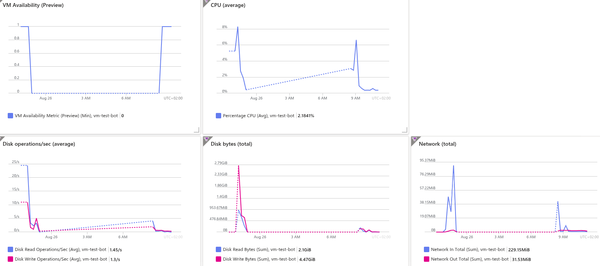

# 🤖 Telegram Concise AI Assistant

This is a straightforward Telegram bot that provides brief, direct answers to user messages by leveraging AI API.

---

## ✨ Features

- **Concise AI Responses:** Fetches short, one-to-two sentence answers from an AI model.
- **Secure Configuration:** Securely loads sensitive API tokens from a `.env` file.

---

## 🚀 Getting Started

Follow these steps to set up and run the bot locally.

### Prerequisites

You will need the following API tokens:
1.  **A Telegram Bot Token:** Obtain this by talking to [@BotFather](https://telegram.me/BotFather) on Telegram.
2.  **A GitHub Token:** This token requires access to the GitHub AI Inference API endpoint.

### Installation

1.  **Clone the repository:**
    ```
    git clone https://github.com/saprykins/telegram_test_bot
    cd telegram_test_bot
    ```

2.  **Create and activate a virtual environment:**
    -   **On macOS/Linux:**
        ```
        virtualenv venv
        source venv/bin/activate
        ```
    -   **On Windows:**
        ```
        py -m venv venv
        venv\Scripts\activate
        ```

3.  **Install dependencies:**
    ```
    pip install -r requirements.txt
    ```

### Configuration

1.  In the root directory of the project, create a file named `.env`.
2.  Add your API tokens to this file as shown below, replacing the placeholder values.

    ```
    TELEGRAM_BOT_TOKEN="YOUR_TELEGRAM_BOT_TOKEN"
    GITHUB_TOKEN="YOUR_GITHUB_TOKEN"
    ```

### Running the Bot

Execute the following command from your terminal:

```
python my_bot.py
```

<!--
## ✨ Future improvements  
Enrich default settings  
Use the bot in groups  
Bot inserts data into google sheets or database  
Voice to text  


# Sources
# Official doc from telegram:  
https://core.telegram.org/bots
https://core.telegram.org/bots/api
https://github.com/python-telegram-bot/python-telegram-bot


Free deployment  
Norht Europe
free tier - Standard B1s (1 vcpu, 1 GiB memory)
free tier - Storage
Initially, it was created with public IP, i connected to user qwerty_05112024, uploaded the code
NB: what you see in ssh isn't correlated with cloudshell vscode

There're costs related to public IP
i deleted it when VM stoped from network interfaces
i should connect via developer bastion (should be free - to be checked)
i could access only to user azureuser
NB: copy past was complicated
i used: 
wget https://raw.githubusercontent.com/saprykins/telegram_test_bot/main/my_bot.py
copy paste + new lines for credentials
-->


## 📈 Azure VM Capacity Tests  
This report summarizes tests on an Azure Standard B1s VM to see how it handles a bot under stress. The goal was to find its limits for a low-cost, free-tier VM.  

### Test Scenario & Results  
We tested the bot with two users: one user continuously sent requests to flood the bot, and another used it normally.  
  
The VM handled both users well. While the stress test caused brief spikes in CPU usage and network traffic, the VM stayed stable and kept responding to the normal user. This shows the Standard B1s can manage sudden, heavy workloads.  

### Conclusion  

The Standard B1s is a enough for a bot that have few users.  

The charts below illustrate the VM's behavior during the two-user stress test.  


<!--
Tests
One can flud the bot with many messages, it stops receiveing it, then it replies
If another user text the bot, another user receives a feedback.
-->